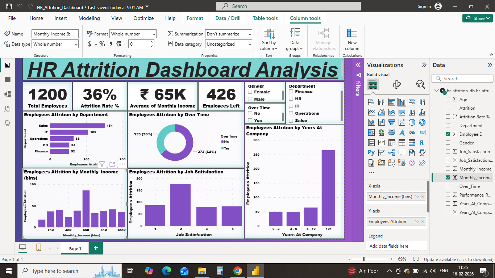

# HR Employee Attrition Analysis Project

## Summary
**Business Problem:** Identify the main drivers of employee attrition so the company can take targeted retention actions.

**Approach & Hypotheses:** Based on common HR knowledge, I hypothesized that department, overtime, and job satisfaction would be strong indicators of attrition risk. I focused the analysis on these dimensions along with income and years at the company to test that hypothesis against the data.

**Key Findings:**
- Overall attrition rate: 36%
- Sales department showed the highest attrition
- Overtime and low job satisfaction were the strongest drivers
- Attrition was more common among employees with fewer years at the company

**Tools Used:** Excel, Power Query, SQL, Power BI

---

## Project Overview
This project focuses on analyzing employee attrition to understand the key factors
that cause employees to leave an organization. Employee attrition directly impacts
company performance, hiring costs, and workforce stability.
The objective of this project is to use data analysis and visualization techniques
to identify attrition patterns and provide actionable insights for HR decision-making.

---

## Project Files Description

### Raw / Unclean Dataset
- Contains original employee data with inconsistent column naming and formats
- Used as the base input for data cleaning
- Key columns include:
  - EmployeeID
  - Age
  - Department
  - Gender
  - MonthlyIncome
  - YearsAtCompany
  - OverTime
  - Attrition
  - JobSatisfaction
  - PerformanceRating

---

### Cleaned Dataset (Using Power Query)
Data cleaning and transformation were performed using **Power Query**.

#### Cleaning Steps Performed:
- Renamed columns to standard and readable formats
- Removed inconsistencies in column naming
- Ensured uniform data types
- Prepared data for SQL analysis and Power BI reporting

#### Cleaned Columns:
- EmployeeID
- Age
- Department
- Gender
- Monthly_Income
- Years_At_Company
- Attrition
- Over_Time
- Job_Satisfaction
- Performance_Rating

---

### SQL Analysis File
SQL was used to perform exploratory analysis and answer key business questions.

#### Key SQL Queries Performed:
- Overall attrition percentage
- Department-wise attrition analysis
- Gender-based attrition comparison
- Average income comparison for attrition vs non-attrition
- Impact of job satisfaction on attrition
- Overtime vs attrition analysis
- Performance rating vs attrition
- Experience (Years at Company) vs attrition

#### Sample Insights Extracted Using SQL:
- Calculated total employees and employees who left
- Identified departments with higher employee exits
- Compared attrition trends across income levels
- Analyzed whether overtime increases attrition

---

### Power BI Dashboard
A Power BI dashboard was created to visually represent attrition trends and KPIs.

#### Power BI Features:
- Interactive visuals and filters
- Department-wise attrition charts
- Attrition percentage KPIs
- Income, job satisfaction, and overtime analysis
- Experience and performance-based attrition insights

#### Measures Created in Power BI:
- Total Employees
- Employees Left
- Attrition Percentage
- Average Monthly Income

---

## Key Insights (Detailed)
- Departments with higher workload showed increased attrition
- Employees with lower monthly income were more likely to leave
- Lower job satisfaction strongly correlated with higher attrition
- Employees working overtime showed a higher tendency to exit
- Attrition was more common among employees with fewer years at the company

---

## Conclusion
This project demonstrates how data cleaning, SQL analysis, and Power BI visualization
can be combined to analyze employee attrition effectively.
The insights generated can help HR teams improve employee engagement, compensation
planning, workload management, and retention strategies.

---

## Tools & Technologies Used
- Power Query – Data cleaning and transformation
- SQL – Data analysis and business queries
- Power BI – Dashboard creation and visualization

---

## Author
**Shubham Bhatt**
Aspiring Data Analyst
Skills: Excel | Power Query | SQL | Power BI
