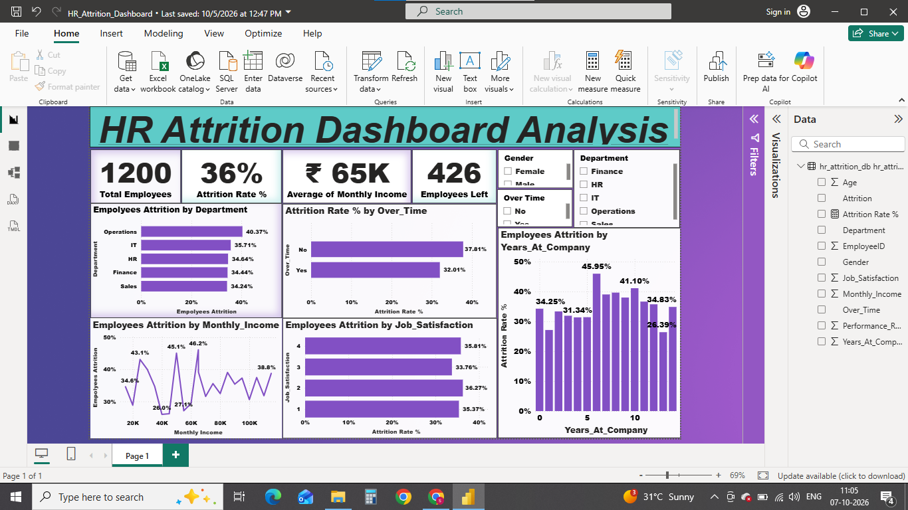

# HR Employee Attrition Analysis Project

## Summary
**Business Problem:** The goal of this project was to find out what is linked to employees leaving a company, so HR has something concrete to look into instead of just guessing.

**Approach & Hypotheses:** Before touching the data, I thought about which factors usually affect attrition in most companies: department, overtime, job satisfaction, salary, and how long someone has worked there. I used these as my starting hypotheses and then tested each one with SQL instead of just assuming they were true.

**Key Findings:**
- Overall attrition rate is **36%** (426 out of 1,200 employees left)
- **Operations** has the highest attrition rate (**40.4%**) compared to 34-36% for the other departments. Sales had more people leave in raw numbers, but Sales is also the biggest department, so its rate is actually the lowest.
- Overtime employees have a slightly **lower** attrition rate (32.0%) than non-overtime employees (37.8%). This surprised me, I expected the opposite.
- Job Satisfaction doesn't seem to change attrition much. All four levels sit between roughly 34% and 36%.
- Monthly Income doesn't show a clean trend either. The line goes up and down across income brackets.
- Employees with **6 years** at the company have the highest attrition rate in this dataset (45.95%). That is worth a closer look, but each year group only has around 60-90 people, so I'm treating it as something to investigate, not a confirmed pattern.

**Tools Used:** Excel, Power Query, SQL, Power BI

---

## About the Data
I created this dataset myself in Excel, using random-generation formulas, to get a realistic HR dataset with the kind of mess real data has (missing values, inconsistent spellings, mixed formats). It is not data from a real company. Because of that, the patterns in this project should be read as practice findings, not as real-world conclusions about why employees leave.

---

## Project Overview
This project looks at employee attrition data to see which factors are linked to people leaving. Attrition is expensive for any business, since hiring takes time and money and you lose people who already know how things work. I took a messy HR dataset, cleaned it, ran SQL queries to answer specific questions, and built a Power BI dashboard to show the results. I also went back and double-checked my own numbers at one point because something looked off, which I've explained below.

---

## Data Cleaning

The raw data had 1,200 rows and the usual problems of an unclean dataset: inconsistent spelling (like "it" instead of "IT"), Y/N mixed with Yes/No, and missing values in every column (between 8% and 21% missing per column). I cleaned it in Power Query.

I didn't fill missing values the same way everywhere. I picked the method based on the column type:
- For number columns (Age, Monthly Income, Years at Company) I used the **mean**, because I checked and the data wasn't skewed, so no extreme values were pulling the average.
- For category columns (Department, Gender, Over Time, Attrition) I used the **mode** (most common value), since you can't average text.
- For Job Satisfaction and Performance Rating (ratings from 1 to 4) I also used the mode. Thinking about it later, median would probably have been the better choice for rating-type values. I'd do that differently next time.

I also standardized the text so "IT" and "it" aren't counted as two different departments, and "Y" and "Yes" mean the same thing everywhere.

---

## A Mistake I Found and Fixed

While building the dashboard, I noticed some charts were showing results that didn't make sense once I thought about them. I dug into it and found the problem was connected to how I filled in the missing values.

For `Years_At_Company`, 91 values were missing and I filled all of them with the mean, which rounded to 7. So in a chart using raw counts, "Year 7" looked like it had way more people leaving than any other year. But that was only because 91 filled-in "7"s were added to that one bucket. It wasn't a real pattern, it was my own missing-value filling making that bucket bigger.

Once I switched the charts to **Attrition Rate %** instead of raw counts, most of this problem went away, because the rate is calculated against each group's own total. After that, Year 6 turned out to have the highest rate (45.95%), not Year 7.

This also changed my Over Time result. At first it looked like overtime employees were leaving a lot more, because 64% of the people who left had worked overtime. But that was misleading, since there are simply more non-overtime employees, so more of the people who left naturally came from that bigger group. When I calculated the rate inside each group, non-overtime employees actually had a slightly higher attrition rate (37.8%) than overtime employees (32.0%).

The biggest lesson from this project wasn't really about attrition. It was that how you fill missing data, and whether you use count or rate, can change your conclusion, sometimes even flip it. I now check this on every chart before trusting it.

---

## SQL Analysis

I could have built all the charts directly in Power BI without SQL, so I want to be upfront about why I used it anyway. SQL let me calculate and check the exact numbers myself before trusting what Power BI showed. It also made me write down the business question first, instead of just dragging fields around to see what comes out.

The main technique I used was `SUM(CASE WHEN Attrition='Yes' THEN 1 ELSE 0 END)`. SQL doesn't have a direct COUNTIF like Excel, so this is the standard way to count rows that match a condition.

**Questions I answered with SQL:**
1. What is the overall attrition rate?
2. Which departments have the most attrition?
3. Does gender make a difference?
4. Do people who leave earn less on average?
5. Does job satisfaction make a difference?
6. Does overtime make a difference?
7. Does performance rating make a difference?
8. Does how long someone has worked here make a difference?

I picked these because each one points to something HR could act on. I skipped things that wouldn't lead to any action even if they showed a pattern.

To check my work, I made sure the numbers from my grouped queries added up to the overall total from query 1. After finding the missing-value issue above, I also recalculated a few of them using rate instead of count.

---

## Power BI Dashboard

**KPI Cards:** Total Employees, Attrition Rate %, Average Monthly Income, Employees Left

**Charts (all use Attrition Rate %, not raw count):**
- Attrition Rate % by Department (horizontal bar)
- Attrition Rate % by Over Time (bar)
- Attrition Rate % by Monthly Income (line)
- Attrition Rate % by Job Satisfaction (bar)
- Attrition Rate % by Years at Company (column)

Once I understood the count vs rate problem, I used Attrition Rate % on every chart, so all of them measure the same thing the same way and none is skewed by group size.

---

## Key Insights

- Operations has the highest attrition rate (40.4%), even though Sales lost more people in raw numbers. Looking only at headcount would point HR to the wrong department first.
- Overtime is not the big attrition driver I expected. The gap between the two groups is small and slightly in the opposite direction.
- Job Satisfaction and Monthly Income don't show a clear pattern with attrition in this data.
- Employees with 6 years at the company have the highest rate in this dataset. With only 60-90 people per year group, I'd treat this as a starting point for further checking, not a final answer.

---

## Limitations
- The data is simulated, so none of these patterns prove why real employees leave.
- Small group sizes mean some of the differences (like Year 6, or Operations vs other departments) could just be normal random variation.
- I did not run statistical significance tests, so I can't say for sure which differences are real and which are noise.
- Missing values were filled with mean/mode, which is a simple method and can affect results, as I found with Years at Company.

---

## Conclusion
This project taught me that data cleaning choices are not just a technical formality, they can change what the analysis tells you. I caught that by checking count vs rate on every chart, and I'll do that by default on future projects.

---

## Tools & Technologies Used
- Power Query: data cleaning and transformation
- SQL: data analysis and business questions
- Power BI: dashboard building and DAX measures

---

## Author
**Shubham Bhatt**
Aspiring Data Analyst
Skills: Excel | Power Query | SQL | Power BI | DAX
